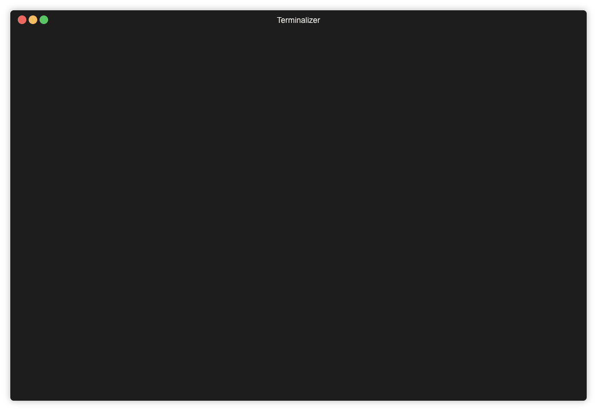

# Eat Your Vegetables



_NOTE THIS IS A WORK IN PROGRESS. DOCUMENTATION AND SOFTWARE IS INCOMPLETE AND IS PROVIDED ON AS IS. PLEASE HELP BY CONTRIBUTING_

## Description
Eat Your Vegetables is a tool that aims to help you improve your codebase over
time. You configure the ambition that you want to set, that is, which files do
you want to be covered by your test tools in an ideal world. Then, every time a
commit is made into your code base, Eat Your Vegetables will ensure that your
are one incremental step closer to that goal.

Run Eat Your Vegetables in your CI server, as part of your test suite. On every
test run it will then look at the previous state, count up the number of
excluded files from your linter/test framework/coverage and _fail_ your tests if
that number hasn't decreased.

## Features
Support for linters, coverage and test tools. For a full list of support tools
see [SUPPORTED_TOOLS.md](docs/SUPPORTED_TOOLS.md)

This project is still in early days so _please_ add support for your framework
if it is missing. There is a simple guide here: [ADDING_ADAPTERS.md](docs/ADDING_ADAPTERS.md)

## Requirements

A newish version of git must be installed on the CI server. Your CI server must
be executing your environment with git available.

## Install

    $ gem install eat_your_vegetables

## Running it

Eat Your Vegetables is intended to be run with

### With docker

For all you hip kids out there, there's a Dockerfile!

```bash
$ docker run --mount type=bind,source=`pwd`,target=/data cfeckardt/eat_your_vegetables:latest
```

## Configuration

In the root of your project create a file named `Veggiefile`

```ruby
ambition do
  include '/'
end

rubocop
simplecov
```

### Setting up CI

#### Travis

```yaml
---
language: ruby
before_script:
  - gem install eat_your_vegetables
script:
  - bundle exec eat_your_vegetables

```

#### Other

In order to run _eyv_ in your CI suite you need to:

1. Ensure git is installed
2. Ensure ruby is installed
3. Run `gem intall eat_your_vegetables`
4. Run `bundle exec eat_your_vegetables` or just `eat_your_vegetables`

Please contribute by adding set up instructions for other CIs.

## Contributing

Nothing special here! Contributions are welcome!

## Copyright

Copyright (c) 2019 Fredrik Eckardt

See {file:LICENSE.txt} for details.
